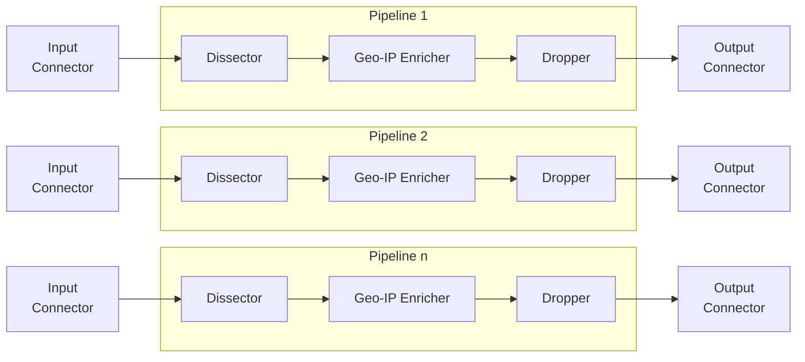

<h1 align="center">Logprep</h1>
<h3 align="center">


[](http://logprep.readthedocs.io/?badge=latest)

<a href="https://codecov.io/github/fkie-cad/Logprep" target="_blank">
    
</a>

</h3>

## Introduction

Logprep allows to collect, process and forward log messages from various data sources.
Log messages are being read and written by so-called connectors.
Currently, connectors for Kafka, Opensearch, S3, HTTP and JSON(L) files exist.

The log messages are processed in serial by a pipeline of processors,
where each processor modifies an event that is being passed through.
The main idea is that each processor performs a simple task that is easy to carry out.
Once the log message is passed through all processors in the pipeline the resulting
message is sent to a configured output connector.

Logprep is primarily designed to process log messages. Generally, Logprep can handle JSON messages,
allowing further applications besides log handling.

- [About Logprep](https://github.com/fkie-cad/Logprep/blob/main/README.md#about-logprep)
- [Installation](https://logprep.readthedocs.io/en/latest/installation.html)
- [Deployment Examples](https://logprep.readthedocs.io/en/latest/examples/index.html)
- [Event Generation](https://logprep.readthedocs.io/en/latest/user_manual/execution.html#event-generation)
- [Documentation](https://logprep.readthedocs.io/en/latest)
- [Container signatures](https://github.com/fkie-cad/Logprep/blob/main/README.md#container-signatures)
- [Container SBOM](https://github.com/fkie-cad/Logprep/blob/main/README.md#container-sbom)
- [Contributing](https://github.com/fkie-cad/Logprep/blob/main/CONTRIBUTING.md)
- [License](https://github.com/fkie-cad/Logprep/blob/main/LICENSE)
- [Changelog](https://github.com/fkie-cad/Logprep/blob/main/CHANGELOG.md)

## About Logprep

### Pipelines

Logprep processes incoming log messages with a configured pipeline that can be spawned
multiple times via multiprocessing.
The following chart shows a basic setup that represents this behaviour.
The pipeline consists of three processors: the `Dissector`, `Geo-IP Enricher` and the
`Dropper`.
Each pipeline runs concurrently and takes one event from it's `Input Connector`.
Once the log messages is fully processed the result will be forwarded to the `Output Connector`,
after which the pipeline will take the next message, repeating the processing cycle.



### Processors

Every processor has one simple task to fulfill.
For example, the `Dissector` can split up long message fields into multiple subfields
to facilitate structural normalization.
The `Geo-IP Enricher`, for example, takes an ip-address and adds the geolocation of it to the
log message, based on a configured geo-ip database.
Or the `Dropper` deletes fields from the log message.

As detailed overview of all processors can be found in the
[processor documentation](https://logprep.readthedocs.io/en/latest/configuration/processor.html).

To influence the behaviour of those processors, each can be configured with a set of rules.
These rules define two things.
Firstly, they specify when the processor should process a log message
and secondly they specify how to process the message.
For example which fields should be deleted or to which IP-address the geolocation should be
retrieved.


### Connectors

Connectors are responsible for reading the input and writing the result to a desired output.
The main connectors that are currently used and implemented are a kafka-input-connector and a
kafka-output-connector allowing to receive messages from a kafka-topic and write messages into a
kafka-topic. Addionally, you can use the Opensearch or Opensearch output connectors to ship the
messages directly to Opensearch or Opensearch after processing.

The details regarding the connectors can be found in the
[input connector documentation](https://logprep.readthedocs.io/en/latest/configuration/input.html)
and
[output connector documentation](https://logprep.readthedocs.io/en/latest/configuration/output.html).

### Configuration

To run Logprep, certain configurations have to be provided. Because Logprep is designed to run in a
containerized environment like Kubernetes, these configurations can be provided via the filesystem or
http. By providing the configuration via http, it is possible to control the configuration change via
a flexible http api. This enables Logprep to quickly adapt to changes in your environment.

First, a general configuration is given that describes the pipeline and the connectors,
and lastly, the processors need rules in order to process messages correctly.

The following yaml configuration shows an example configuration for the pipeline shown
in the graph above:

```yaml
process_count: 3
timeout: 0.1

pipeline:
  - dissector:
      type: dissector
      rules:
        - https://your-api/dissector/
        - rules/01_dissector/rules/
  - geoip_enricher:
      type: geoip_enricher
      rules:
        - https://your-api/geoip/
        - rules/02_geoip_enricher/rules/
      tree_config: artifacts/tree_config.json
      db_path: artifacts/GeoDB.mmdb
  - dropper:
      type: dropper
      rules:
        - rules/03_dropper/rules/

input:
  mykafka:
    type: confluentkafka_input
    bootstrapservers: [127.0.0.1:9092]
    topic: consumer
    group: cgroup
    auto_commit: true
    session_timeout: 6000
    offset_reset_policy: smallest
output:
  opensearch:
    type: opensearch_output
    hosts:
        - 127.0.0.1:9200
    default_index: default_index
    error_index: error_index
    message_backlog_size: 10000
    timeout: 10000
    max_retries:
    user: the username
    secret: the passord
    cert: /path/to/cert.crt
```

The following yaml represents a dropper rule which according to the previous configuration
should be in the `rules/03_dropper/rules/` directory.

```yaml
filter: "message"
drop:
  - message
description: "Drops the message field"
```

The condition of this rule would check if the field `message` exists in the log.
If it does exist then the dropper would delete this field from the log message.

Details about the rule language and how to write rules for the processors can be found in the
[rule configuration documentation](https://logprep.readthedocs.io/en/latest/configuration/rules.html).

## Documentation

The documentation for Logprep is online at https://logprep.readthedocs.io/en/latest/ or it can
be built locally via:

```
sudo apt install pandoc
pip install -e .[doc]
cd ./doc/
make html
```

A HTML documentation can be then found in `doc/_build/html/index.html`.

## Container signatures

From release 15 on, Logprep containers are signed using the
[cosign](https://github.com/sigstore/cosign) tool.
To verify the container, you can copy the following public key into a file
`logprep.pub`:

```
-----BEGIN PUBLIC KEY-----
MFkwEwYHKoZIzj0CAQYIKoZIzj0DAQcDQgAEgkQXDi/N4TDFE2Ao0pulOFfbGm5g
kVtARE+LJfSFI25BanOG9jaxxRGVt+Sa1KtQbMcy7Glxu0s7XgD9VFGjTA==
-----END PUBLIC KEY-----
```

And use it to verify the signature:

```
cosign verify --key logprep.pub ghcr.io/fkie-cad/logprep:py3.11-latest
```

The output should look like:

```
Verification for ghcr.io/fkie-cad/logprep:py3.11-latest --
The following checks were performed on each of these signatures:
  - The cosign claims were validated
  - Existence of the claims in the transparency log was verified offline
  - The signatures were verified against the specified public key

[{"critical":{"identity":{"docker-reference":"ghcr.io/fkie-cad/logprep"}, ...
```

## Container SBOM

From release 15 on, Logprep container images are shipped with a generated sbom.
To verify the attestation and extract the SBOM use
[cosign](https://github.com/sigstore/cosign) with:

```
cosign verify-attestation --key logprep.pub ghcr.io/fkie-cad/logprep:py3.11-latest | jq '.payload | @base64d | fromjson | .predicate | .Data | fromjson' > sbom.json
```

The output should look like:

```
Verification for ghcr.io/fkie-cad/logprep:py3.11-latest --
The following checks were performed on each of these signatures:
  - The cosign claims were validated
  - Existence of the claims in the transparency log was verified offline
  - The signatures were verified against the specified public key
```

Finally, you can view the extracted sbom with:

```
cat sbom.json | jq
```
