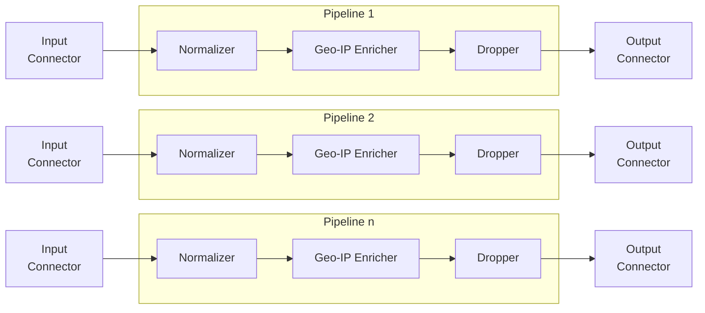
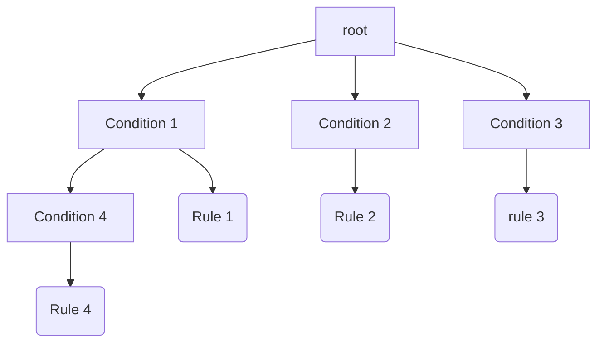

<h1 align="center">Logprep</h1>
<h3 align="center">


[](http://logprep.readthedocs.io/?badge=latest)

<a href="https://codecov.io/github/fkie-cad/Logprep" target="_blank">
    
</a>

</h3>

## Introduction

Logprep allows to collect, process and forward log messages from various data sources.
Log messages are being read and written by so-called connectors.
Currently, connectors for Kafka and JSON files exist.

The log messages are processed step-by-step by a pipeline of processors,
where each processor modifies an event that is being passed through.
The main idea is that each processor performs a simple task that is easy to carry out.
Once the log massage is passed through all processors in the pipeline the resulting
message is sent to a configured output connector.

Logprep is designed to be expandable with new connectors and processors.

Logprep is primarily designed to process log messages. Generally, Logprep can handle JSON messages,
allowing further applications besides log handling.

This readme provides basic information about the following topics:
- [About Logprep](#about-logprep)    
- [Getting Started](#getting-started)
- [Docker Quickstart](#docker-quickstart-environment)
- [Documentation](#documentation)
- [Contributing](#contributing)
- [License](#license)

More detailed information can be found in the 
[Documentation](https://logprep.readthedocs.io/en/latest/).

## About Logprep

### Pipelines

Logprep processes incoming log messages with a configured pipeline that can be spawned
multiple times via multiprocessing.
The following chart shows a basic setup that represents this behaviour.
The pipeline consists of three processors the `Normalizer`, `Geo-IP Enricher` and the 
`Dropper`. 
Each pipeline runs concurrently and takes one event from the `Input Connector`.
Once the log messages is fully processed the result will be forwarded to the `Output Connector`,
after which the pipeline will take the next message, repeating the processing cycle.



### Processors

Every processor has one simple task to fulfill.
For example, the `Normalizer` can split up long message fields into multiple subfields or copy 
content from one field into another one, leading to a normalized message pattern.
The `Geo-IP Enricher`, for example, takes an ip-address and adds the geolocation of it to the 
log message, based on a configured geo-ip database. 
Or the `Dropper` deletes fields from the log message.

As detailed overview of all processors can be found in the
[processor documentation](https://logprep.readthedocs.io/en/latest/user_manual/configuration/processor.html).

To influence the behaviour of those processors, each can be configured with a set of rules.
These rules define two things.
Firstly, they specify when the processor should process a log message
and secondly they specify how to process the message. 
For example which fields should be deleted or to which IP-address the geolocation should be 
retrieved.

For performance reasons on startup all rules per processor are aggregated to a generic and a specific rule tree, respectively. 
Instead of evaluating all rules independently for each log message the message is checked against 
the rule tree.
Each node in the rule tree represents a condition that has to be meet,
while the leafs represent changes that the processor should apply.
If no condition is met, the processor will just pass the log event to the next processor.

The following chart gives an example of such a rule tree:



To further improve the performance, it is possible to prioritize specific nodes of the rule tree,
such that broader conditions are higher up in the tree. 
And specific conditions can be moved further down.
Following json gives an example of such a rule tree configuration. 
This configuration will lead to the prioritization of `tags` and `message` in the rule tree.

```json
{
  "priority_dict": {
    "category": "01",
    "message": "02"
  },
  "tag_map": {
    "check_field_name": "check-tag"
  }
}
```

Instead of writing very specific rules that apply to single log messages, it is also possible
to define generic rules that apply to multiple messages. 
It is possible to define a set of generic and specific rules for each processor, resulting 
in two rule trees. 

### Connectors

Connectors are responsible for reading the input and writing the result to a desired output. 
The main connectors that are currently used and implemented are a kafka-input-connector and a
kafka-output-connector allowing to receive messages from a kafka-topic and write messages into a
kafka-topic. 

The details regarding the connectors can be found in the
[input connector documentation](https://logprep.readthedocs.io/en/latest/user_manual/configuration/input.html)
and
[output connector documentation](https://logprep.readthedocs.io/en/latest/user_manual/configuration/output.html).

### Configuration

To run Logprep, certain configurations have to be provided. 
First, a general configuration is given that describes the pipeline and the connectors, 
and lastly, the processors need rules in order to process messages correctly.

The following yaml configuration shows an example configuration for the pipeline shown 
in the graph above:

```yaml
process_count: 3
timeout: 0.1

pipeline:
  - normalizer:
      type: normalizer
      specific_rules:
        - rules/01_normalizer/specific/
      generic_rules:
        - rules/01_normalizer/generic/
      regex_mapping: artifacts/regex_mapping.yml
      grok_patterns: artifacts/grok_patterns/
  - geoip_enricher:
      type: geoip_enricher
      specific_rules:
        - rules/02_geoip_enricher/specific/
      generic_rules:
        - rules/02_geoip_enricher/generic/
      tree_config: artifacts/tree_config.json
      db_path: artifacts/GeoDB.mmdb
  - dropper:
      type: dropper
      specific_rules:
        - rules/03_dropper/specific/
      generic_rules:
        - rules/03_dropper/generic/
              
input:
  mykafka:
    type: confluentkafka_input
    bootstrapservers: [127.0.0.1:9092]
    topic: consumer
    group: cgroup
    auto_commit: on
    session_timeout: 6000
    offset_reset_policy: smallest
output:
  myotherkafka:
    type: confluentkafka_output
    bootstrapservers: [127.0.0.2:9092]
    topic: producer
    error_topic: producer_error
    ack_policy: all
    compression: gzip
    maximum_backlog: 10000
    linger_duration: 0
    flush_timeout: 30
    send_timeout: 2
```

The following yaml represents a dropper rule which according to the previous configuration 
should be in the `rules/03_dropper/generic/` directory.

```yaml
filter: "message"
drop:
  - message
description: "Drops the message field"
```

The condition of this rule would check if the field `message` exists in the log.
If it does exist then the dropper would delete this field from the log message.

Details about the rule language and how to write rules for the processors can be found in the
[rule language documentation](https://logprep.readthedocs.io/en/latest/user_manual/rule_language.html).

## Getting Started

### Installation

Python should be present on the system, currently supported are the versions 3.6 - 3.9.
To install Logprep you have following options:

**1. Option:** Installation via PyPI: 

This option is recommended if you just want to use the latest release of logprep.
```
pip install logprep
```

**2. Option:** Installation via Git Repository:

This option is recommended if you are interested in the latest developments and might want to 
contribute to them.
```
git clone https://github.com/fkie-cad/Logprep.git
cd Logprep
pip install -r requirements.txt
```

**3. Option:** Installation via Github Release

This option is recommended if you just want to try out the latest developments.
```
pip install git+https://github.com/fkie-cad/Logprep.git@latest
```

**4. Option:** Docker build from current commit

This option can be used to build a container image from a specific commit
```
docker build -t logprep .
docker run logprep --help
```

### Testing

Tox can be used to perform unit and acceptance tests (install tox via `pip3 install tox`).
Tests are started by executing `tox` in the project root directory.
This creates a virtual test environment and executes tests within it.

Multiple different test environments were defined for tox.
Those can be executed via: `tox -e [name of the test environment]`.
For Example:

```
tox -e py36-all
```

This runs all tests, calculates the test coverage and evaluates the code quality for the python 
3.6 version.

Multiple environments can be tested within one call: 

```
tox -e py36-all -e py37-all -e py38-all -e py39-all
```

If you want to run them in parallel attach the option `-p`.
This can lead to side effects in I/O operations though, like concurrences in writing or reading
files.
 
An overview of the test environments can be obtained by executing:

```
tox -av
```

In case the requirements change, the test environments must be rebuilt with the parameter `-r`:

```
tox -e all -r
```

### Semgrep

To run the semgrep rules against the semgrep python registry at least python 3.7 is required. 
Because of that and the default logprep support for python 3.6 semgrep is not part of the 
requirements_dev.txt. 
If you want to run semgrep rules use a python environment with version higher than 3.6 and run

```
pip install semgrep
```

Afterwards you can just call the tox environment with for example 

```
tox -e py37-semgrep
```

### Running Logprep

Depending on how you have installed Logprep you have different choices to run Logprep as well.  
If you have installed it via PyPI or the Github Development release just run:

```
logprep $CONFIG
```

If you have installed Logprep via cloning the repository then you should run it via:

```
PYTHONPATH="." python3 logprep/run_logprep.py $CONFIG
```

Where `$CONFIG` is the path to a configuration file (see the documentation about the 
[configuration](https://logprep.readthedocs.io/en/latest/user_manual/configuration/index.html)).
The next sections all assume an installation via pip

### Verifying Configuration

The following command can be executed to verify the configuration file without having to run Logprep:

```
logprep --verify-config $CONFIG
```

Where `$CONFIG` is the path to a configuration file (see the documentation about the 
[configuration](https://logprep.readthedocs.io/en/latest/user_manual/configuration/index.html)).

### Validating Labeling-Schema and Rules

The following command can be executed to validate the schema and the rules:

```
logprep --validate-rules $CONFIG
```

Where `$CONFIG` is the path to a configuration file (see the documentation about the 
[configuration](https://logprep.readthedocs.io/en/latest/user_manual/configuration/index.html)).

Alternatively, the validation can be performed directly. Assuming you have cloned the repository 
from git. 

```
PYTHONPATH="." python3 logprep/util/schema_and_rule_checker.py --labeling-schema $LABELING_SCHEMA --labeling-rules $LABELING_RULES
```

Where `$LABELING_SCHEMA` is the path to a labeling-schema (JSON file) and `$LABELING_RULES` is 
the path to a directory with rule files (JSON/YML files, see Rules.md, subdirectories 
are permitted)

Analogously, `--normalization-rules` and `--pseudonymizer-rules` can be used.

Validation does also perform a verification of the pipeline section of the Logprep configuration.

### Reload the Configuration

To change the configuration of Logprep it is not needed to restart Logprep entirely.
Instead, it can be issued to reload the configuration. 
For this, the signal `SIGUSR1` must be send to the Logprep process.

If the configuration does not pass a consistency check, then an error message is logged and 
Logprep keeps running with the previous configuration.
The configuration should be then checked and corrected on the basis of the error message.

## Docker Quickstart Environment

Logprep was designed to work with the Elastic Stack and Kafka.
This repository comes with a docker-compose file that builds a pre-configured Elastic Stack with 
Kafka and Logprep.
To get it running docker and docker-compose (version >= 1.28) must be first installed.
The docker-compose file is located in the directory quickstart.

### Running the Test Environment

Before running, docker-compose `sysctl -w vm.max_map_count=262144` must be executed.
Otherwise, Elasticsearch is not properly started.
The environment can either be started with a Logprep container or without one.
To start it without Logprep, the command `docker-compose up -d` can be executed from within 
the quickstart directory.
It starts and connects Kafka, ZooKeeper, Logstash, Elasticsearch and Kibana.
Logprep can be then started from the host once the quickstart environment is running and 
fully loaded.
The Logprep configuration file `quickstart/exampledata/config/pipeline.yml` can be used to 
connect to the quickstart environment.
To start the whole environment including a Logprep container, the 
command `docker-compose --profile logprep up -d` can be executed.

### Interacting with the Quickstart Environment

It is now possible to write JSON events into Kafka and read the processed events in Kibana.

Once everything has started, Kibana can be accessed by a web-browser with the 
address `127.0.0.1:5601`.
Kafka can be accessed with the console producer and consumer from Kafka with the 
address `127.0.0.1:9092` or from within the docker container `Kafka`.
The table below shows which ports have been exposed on localhost for the services.

#### Table of Ports for Services

|          | Kafka | ZooKeeper | Elasticsearch | Kibana |
| ---      | ---   | ---       | ---           | ---    |
| **Port** | 9092  | 2181      | 9200          | 5601   |

The example rules that are used in the docker instance of Logprep can be found 
in `quickstart/exampledata/rules`.
Example events that trigger for the example rules can be found in 
`quickstart/exampledata/input_logdata/test_input.jsonl`.
These events can be added to Kafka with the Kafka console producer within the Kafka container by 
executing the following command:

`(docker exec -i kafka /opt/kafka/bin/kafka-console-producer.sh --bootstrap-server 127.0.0.1:9092 --topic consumer) < exampledata/input_logdata/test_input.jsonl`

Once the events have been processed for the first time, the new indices *processed*, *sre* 
and *pseudonyms* should be available in Kibana.

The environment can be stopped via `docker-compose down`.

## Documentation

The documentation for Logprep is online at https://logprep.readthedocs.io/en/latest/ or it can 
be built locally via tox (install via `pip3 install tox`). 
Building the documentation is done by executing the following command from within 
the project root directory:

```
tox -e py36-docs
```

A HTML documentation can be then found in `doc/_build/html/index.html`.

## Contributing

Every contribution is highly appreciated.
If you have ideas or improvements feel free to create a fork and open a pull requests. 
Issues and engagement in open discussions are also welcome.

## License

Logprep is distributed under the LGPL-2.1 License. See LICENSE file for more information.
