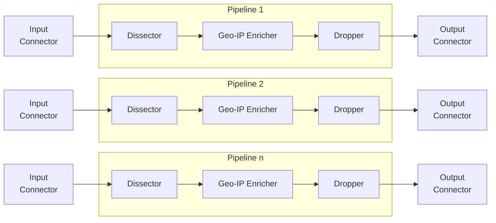
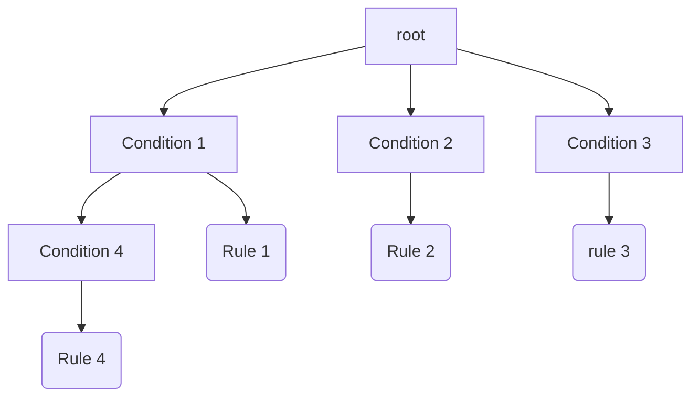

<h1 align="center">Logprep</h1>
<h3 align="center">


[](http://logprep.readthedocs.io/?badge=latest)

<a href="https://codecov.io/github/fkie-cad/Logprep" target="_blank">
    
</a>

</h3>

## Introduction

Logprep allows to collect, process and forward log messages from various data sources.
Log messages are being read and written by so-called connectors.
Currently, connectors for Kafka, Opensearch, Opensearch and JSON(L) files exist.
Additionally, an Input Connector for HTTP Input is provided, which starts an uvicorn server and
accepts log message via POST Requests.

The log messages are processed step-by-step by a pipeline of processors,
where each processor modifies an event that is being passed through.
The main idea is that each processor performs a simple task that is easy to carry out.
Once the log massage is passed through all processors in the pipeline the resulting
message is sent to a configured output connector.

Logprep is designed to be expandable with new connectors and processors.

Logprep is primarily designed to process log messages. Generally, Logprep can handle JSON messages,
allowing further applications besides log handling.

This readme provides basic information about the following topics:
- [About Logprep](#about-logprep)
- [Getting Started](#getting-started)
- [Docker Quickstart](#logprep-quickstart-environment)
- [Event Generation](#event-generation)
- [Documentation](#documentation)
- [Contributing](#contributing)
- [License](#license)

More detailed information can be found in the
[Documentation](https://logprep.readthedocs.io/en/latest/).

## About Logprep

### Pipelines

Logprep processes incoming log messages with a configured pipeline that can be spawned
multiple times via multiprocessing.
The following chart shows a basic setup that represents this behaviour.
The pipeline consists of three processors: the `Dissector`, `Geo-IP Enricher` and the
`Dropper`.
Each pipeline runs concurrently and takes one event from it's `Input Connector`.
Once the log messages is fully processed the result will be forwarded to the `Output Connector`,
after which the pipeline will take the next message, repeating the processing cycle.



### Processors

Every processor has one simple task to fulfill.
For example, the `Dissector` can split up long message fields into multiple subfields
to facilitate structural normalization.
The `Geo-IP Enricher`, for example, takes an ip-address and adds the geolocation of it to the
log message, based on a configured geo-ip database.
Or the `Dropper` deletes fields from the log message.

As detailed overview of all processors can be found in the
[processor documentation](https://logprep.readthedocs.io/en/latest/user_manual/configuration/processor.html).

To influence the behaviour of those processors, each can be configured with a set of rules.
These rules define two things.
Firstly, they specify when the processor should process a log message
and secondly they specify how to process the message.
For example which fields should be deleted or to which IP-address the geolocation should be
retrieved.

For performance reasons on startup all rules per processor are aggregated to a generic and a specific rule tree, respectively.
Instead of evaluating all rules independently for each log message the message is checked against
the rule tree.
Each node in the rule tree represents a condition that has to be meet,
while the leafs represent changes that the processor should apply.
If no condition is met, the processor will just pass the log event to the next processor.

The following chart gives an example of such a rule tree:



To further improve the performance, it is possible to prioritize specific nodes of the rule tree,
such that broader conditions are higher up in the tree.
And specific conditions can be moved further down.
Following json gives an example of such a rule tree configuration.
This configuration will lead to the prioritization of `tags` and `message` in the rule tree.

```json
{
  "priority_dict": {
    "category": "01",
    "message": "02"
  },
  "tag_map": {
    "check_field_name": "check-tag"
  }
}
```

Instead of writing very specific rules that apply to single log messages, it is also possible
to define generic rules that apply to multiple messages.
It is possible to define a set of generic and specific rules for each processor, resulting
in two rule trees.

### Connectors

Connectors are responsible for reading the input and writing the result to a desired output.
The main connectors that are currently used and implemented are a kafka-input-connector and a
kafka-output-connector allowing to receive messages from a kafka-topic and write messages into a
kafka-topic. Addionally, you can use the Opensearch or Opensearch output connectors to ship the
messages directly to Opensearch or Opensearch after processing.

The details regarding the connectors can be found in the
[input connector documentation](https://logprep.readthedocs.io/en/latest/user_manual/configuration/input.html)
and
[output connector documentation](https://logprep.readthedocs.io/en/latest/user_manual/configuration/output.html).

### Configuration

To run Logprep, certain configurations have to be provided. Because Logprep is designed to run in a
containerized environment like Kubernetes, these configurations can be provided via the filesystem or
http. By providing the configuration via http, it is possible to control the configuration change via
a flexible http api. This enables Logprep to quickly adapt to changes in your environment.

First, a general configuration is given that describes the pipeline and the connectors,
and lastly, the processors need rules in order to process messages correctly.

The following yaml configuration shows an example configuration for the pipeline shown
in the graph above:

```yaml
process_count: 3
timeout: 0.1

pipeline:
  - dissector:
      type: dissector
      specific_rules:
        - https://your-api/dissector/
      generic_rules:
        - rules/01_dissector/generic/
  - geoip_enricher:
      type: geoip_enricher
      specific_rules:
        - https://your-api/geoip/
      generic_rules:
        - rules/02_geoip_enricher/generic/
      tree_config: artifacts/tree_config.json
      db_path: artifacts/GeoDB.mmdb
  - dropper:
      type: dropper
      specific_rules:
        - rules/03_dropper/specific/
      generic_rules:
        - rules/03_dropper/generic/

input:
  mykafka:
    type: confluentkafka_input
    bootstrapservers: [127.0.0.1:9092]
    topic: consumer
    group: cgroup
    auto_commit: true
    session_timeout: 6000
    offset_reset_policy: smallest
output:
  opensearch:
    type: opensearch_output
    hosts:
        - 127.0.0.1:9200
    default_index: default_index
    error_index: error_index
    message_backlog_size: 10000
    timeout: 10000
    max_retries:
    user: the username
    secret: the passord
    cert: /path/to/cert.crt
```

The following yaml represents a dropper rule which according to the previous configuration
should be in the `rules/03_dropper/generic/` directory.

```yaml
filter: "message"
drop:
  - message
description: "Drops the message field"
```

The condition of this rule would check if the field `message` exists in the log.
If it does exist then the dropper would delete this field from the log message.

Details about the rule language and how to write rules for the processors can be found in the
[rule configuration documentation](https://logprep.readthedocs.io/en/latest/user_manual/configuration/rules.html).

## Getting Started

### Installation

Python should be present on the system, currently supported are the versions 3.10 - 3.12.

To install Logprep you have following options:

**1. Option:** Installation via PyPI:

This option is recommended if you just want to use the latest release of logprep.
```
pip install logprep
```

**2. Option:** Installation via Git Repository:

This option is recommended if you are interested in the latest developments and might want to
contribute to them.
```
git clone https://github.com/fkie-cad/Logprep.git
cd Logprep
pip install -r requirements.txt
```

**3. Option:** Installation via Github Release

This option is recommended if you just want to try out the latest developments.
```
pip install git+https://github.com/fkie-cad/Logprep.git@latest
```

**4. Option:** Docker build from current commit

This option can be used to build a container image from a specific commit
```
docker build -t logprep .
docker run logprep --help
```

### Testing

We use `pytest` as our testing framework. We have unittests located in `./tests/unit` and
acceptance tests located in `./tests/acceptance`.

Run all tests with:

```
pytest ./tests --cov=logprep --cov-report=xml -vvv
```

### Running Logprep

Depending on how you have installed Logprep you have different choices to run Logprep as well.
If you have installed it via PyPI or the Github Development release just run:

```
logprep run $CONFIG
```

If you have installed Logprep via cloning the repository then you should run it via:

```
PYTHONPATH="." python3 logprep/run_logprep.py run $CONFIG
```

Where `$CONFIG` is the path or uri to a configuration file (see the documentation about the
[configuration](https://logprep.readthedocs.io/en/latest/user_manual/configuration/index.html)).
The next sections all assume an installation via pip

### Verifying Configuration

The following command can be executed to verify the configuration file without having to run Logprep:

```
logprep test config $CONFIG
```

Where `$CONFIG` is the path or uri to a configuration file (see the documentation about the
[configuration](https://logprep.readthedocs.io/en/latest/user_manual/configuration/index.html)).

### Reload the Configuration

To change the configuration of Logprep it is not needed to restart Logprep entirely.
Instead, it can be issued to reload the configuration.
For this, the signal `SIGUSR1` must be send to the Logprep process.

Additionally, a `config_refresh_interval` can be set to periodically and automatically refresh the given configuration.
This can be useful in case of containerized environments (such as Kubernetes), when pod volumes often change
on the fly.

If the configuration does not pass a consistency check, then an error message is logged and
Logprep keeps running with the previous configuration.
The configuration should be then checked and corrected on the basis of the error message.

## Logprep Quickstart Environment

To demonstrate the functionality of logprep this repo comes with a complete `kafka`, `lokgprep` and
`opensearch` stack.
To get it running `docker` and `docker-compose` (version >= 1.28) must be first installed.
The docker-compose file is located in the directory `quickstart`.
A prerequisite is to run `sysctl -w vm.max_map_count=262144`, otherwise Opensearch might not
properly start.

The environment can either be started with a Logprep container or without one:

### Run without Logprep Container (default)

  1. Run from within the `quickstart` directory:
     ```bash
     docker-compose up -d
     ```
     It starts and connects `Kafka`, `logprep`, `Opensearch` and `Opensearch Dashboards`.
  2. Run Logprep against loaded environment from main `Logprep` directory:
     ```bash
     logprep run quickstart/exampledata/config/pipeline.yml
     ```

### Run with Logprep Container

  * Run from within the `quickstart` directory:
    ```bash
    docker-compose --profile logprep up -d
    ```

### Run with getting config from http server with basic authentication

  * Run from within the `quickstart` directory:
    ```bash
    docker-compose --profile basic_auth up -d
    ```
  * Run within the project root directory:
    ```bash
    export LOGPREP_CONFIG_AUTH_USERNAME="user"
    export LOGPREP_CONFIG_AUTH_PASSWORD="password"
    logprep http://localhost:8081/config/pipeline.yml
    ```

### Run with getting config from FDA with oauth2 authentication

Start logprep by using the oauth2 profile with docker-compose:

    ```bash
    docker-compose --profile oauth2 up -d
    ```


In order to run logprep with the FDA configuration it is necessary to set the following environment
variables:

- `LOGPREP_CONFIG_AUTH_METHOD=oauth`
- `LOGPREP_CONFIG_AUTH_TOKEN=<TOKEN>` (can be intercepted from the FDA<->Keycloak http requests)
- `LOGPREP_INPUT=<INPUT_CONNECTOR_CONFIG>`
- `LOGPREP_OUTPUT=<OUTPUT_CONNECTOR_CONFIG>`
- `LOGPREP_OPTIONS=<GENERAL_LOGPREP_CONFIG>`

Once they are set logprep can be started with:

```bash
logprep run "http://localhost:8000/api/v1/pipelines?stage=prod&logclass=ExampleClass"
```

### Interacting with the Quickstart Environment

The start up takes a few seconds to complete, but once everything is up
and running it is possible to write JSON events into Kafka and read the processed events in
Opensearch Dashboards. Following services are available after start up:

| Service                | Location          | User     | Password |
|:-----------------------|:------------------|:---------|:---------|
| Kafka:                 | `localhost:9092`  | /        | /        |
| Kafka Exporter:        | `localhost:9308`  | /        | /        |
| Logprep metrics:       | `localhost:8001`  | /        | /        |
| Opensearch:            | `localhost:9200`  | /        | /        |
| Opensearch Dashboards: | `localhost:5601`  | /        | /        |
| Grafana Dashboards:    | `localhost:3000`  | admin    | admin    |
| Prometheus:            | `localhost:9090`  | /        | /        |
| Nginx:                 | `localhost:8081`  | user     | password |
| Keycloak:              | `localhost:8080`  | admin    | admin    |
| Keycloak Postgres:     | `localhost:5432`  | keycloak | bitnami  |
| FDA:                   | `localhost:8002`  | logprep  | logprep  |
| FDA Postgres:          | `localhost:25432` | fda      | fda      |

The example rules that are used in the docker instance of Logprep can be found
in `quickstart/exampledata/rules`.
Example events that trigger for the example rules can be found in
`quickstart/exampledata/input_logdata/logclass/test_input.jsonl`.
These events can be added to Kafka with the following command:

```bash
(docker exec -i kafka kafka-console-producer.sh --bootstrap-server 127.0.0.1:9092 --topic consumer) < exampledata/input_logdata/logclass/test_input.jsonl
```

Once the events have been processed for the first time, the new indices *processed*, *sre*
and *pseudonyms* should be available in Opensearch Dashboards.

The environment can be stopped via `docker-compose down`.

## Event Generation

Logprep has the additional functionality of generating events and sending them to two
different targets.
It can send events to kafka, while also loading events from kafka or reading them from file,
and it can send events to a http endpoint as POST requests.

Following sections describe the usage of these event generators.

### Kafka
The kafka load-tester can send a configurable amount of documents to Kafka.
The documents that are being send can be obtained either from Kafka or from a file with JSON lines.

It can be configured how many documents should be retrieved from Kafka (if Kafka is used as source)
and how many documents will be sent.
Documents obtained from Kafka won't be written down to disk.

The documents will be sent repeatedly until the desired amount has been sent.
The `tags` field and the `_index` field of each document will be set to `load-tester`.
Furthermore, a field `load-tester-unique` with a unique value will be added to each document every
time a document is sent.
This is done to prevent that repeatedly sent documents are identical.

To find out more about the usage of the kafka load-tester execute:

```bash
logprep generate kafka --help
```

### Configuration
The kafka load-tester is configured via a YAML file.
It must have the following format:

```yaml
logging_level: LOG_LEVEL  # Default: "INFO"
source_count: INTERGER  # Number of documents to obtain form Kafka
count: INTERGER  # Number of documents to send
process_count: INTERGER  # Number of processes (default: 1)
profile: BOOL  # Shows profiling data (default: false)
target_send_per_sec: INTERGER  # Desired number of documents to send per second with each process. Setting it to 0 sends as much as possible (default: 0).

kafka:
  bootstrap_servers:  # List of bootstrap servers
    - URL:PORT  # i.e. "127.0.0.1:9092"
  consumer:  # Kafka consumer
    topic: STRING  # Topic to obtain documents from
    group_id: STRING  # Should be different from the group_id of the Logprep Consumer, otherwise the offset in Logprep will be changed!
    timeout: FLOAT  # Timeout for retrieving documents (default: 1.0)
  producer:  # Kafka producer
    acks: STRING/INTERGER # Determines if sending should be acknowledged (default: 0)
    compression_type: STRING  # Compression type (default: "none")
    topic: STRING  # Topic to send documents to
    queue_buffering_max_messages: INTEGER # Batch for sending documents (default: 10000)
    linger_ms: INTEGER # Time to wait before a batch is sent if the max wasn't reached before (default: 5000)
    flush_timeout: FLOAT # Timeout to flush the producer (default 30.0)
  ssl:  # SSL authentication (Optional)
    ca_location: STRING
    certificate_location: STRING
    key:
      location: STRING
      password: STRING # Optional
```
Unused parameters must be removed or commented.

### Http

The http endpoint allows for generating events based on templated sample files which are stored
inside a dataset directory.

The dataset directory with the sample files has to have the following format:

```
 | - Test-Logs-Directory
 | | - Test-Logs-Class-1-Directory
 | | | - config.yaml
 | | | - Test-Logs-1.jsonl
 | | | - Test-Logs-2.jsonl
 | | - Test-Logs-Class-2-Directory
 | | | - config.yaml
 | | | - Test-Logs-A.jsonl
 | | | - Test-Logs-B.jsonl
```

While the jsonl event files can have arbitrary names, the `config.yaml` needs to be called exactly
that. It also needs to follow the following schema:

```yaml
target_path: /endpoint/logsource/path
timestamps:
  - key: TIMESTAMP_FIELD_1
    format: "%Y%m%d"
  - key: TIMESTAMP_FIELD_1
    format: "%H%M%S"
    time_shift: "+0200"  # Optional, sets time shift in hours and minutes, if needed ([+-]HHMM)
```

To find out more about the usage of the http event generator execute:

```bash
logprep generate http --help
```

## Documentation

The documentation for Logprep is online at https://logprep.readthedocs.io/en/latest/ or it can
be built locally via:

```
sudo apt install pandoc
cd ./doc/
pip install -r ./requirements.txt
make html
```

A HTML documentation can be then found in `doc/_build/html/index.html`.

## Contributing

Every contribution is highly appreciated.
If you have ideas or improvements feel free to create a fork and open a pull requests.
Issues and engagement in open discussions are also welcome.

## License

Logprep is distributed under the LGPL-2.1 License. See LICENSE file for more information.
