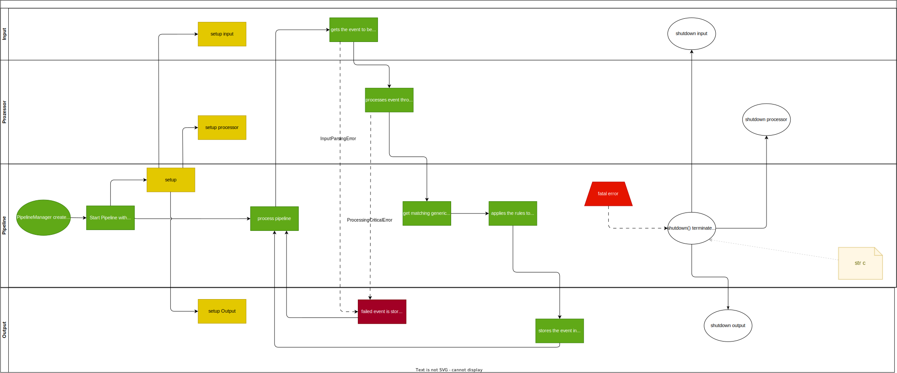

============
Architecture
============

Overview
========

Logprep is designed to receive, process and forward log messages.
It consists of several interconnected components that work together to make this possible.

.. raw:: html
   :file: ../../development/architecture/diagramms/logprep_start.drawio.html

Processor
=========

.. raw:: html
   :file: ../../development/architecture/diagramms/process-Combined.drawio.html

Pipeline
========

Interaction
===========

(Sequence-) Diagramm of the interaction between the components.

To see how Logprep starts and what the interactions are at the start have a look at the following diagram:

.. raw:: html
    :file: ../../development/architecture/diagramms/logprep_start.svg

Expandability
=============

Logprep is designed to be extended with new Connectors and Processors.
